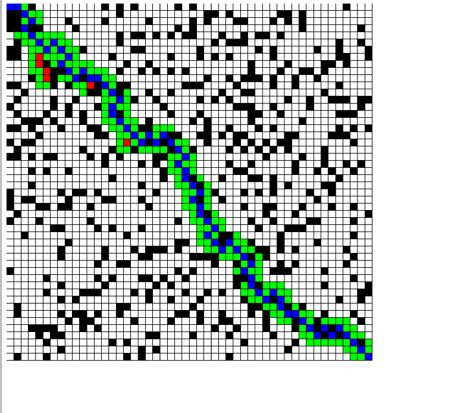

# A-Star-Search-Visualization

This is a simple visualization of the A Star search algorithm. A landscape is randomly generated with barriers. The starting point is the top right of the frame and the desired end is the bottom right. Blue squares represent the path, green squares represent the spaces currently in the open set, and red squares represent the spaces in the closed set.

</img>
